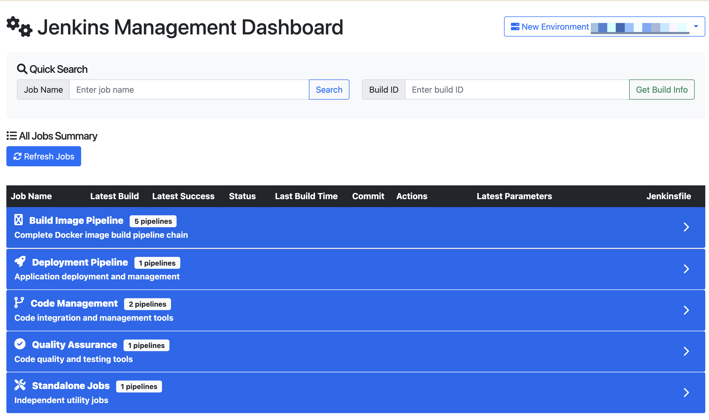
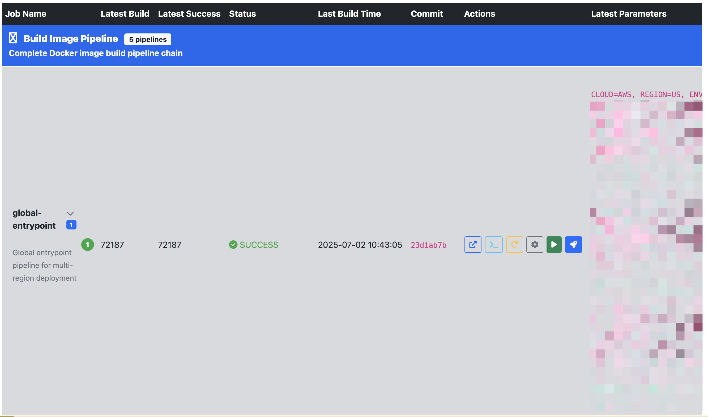

# Jenkins Management Dashboard

## 为什么做这个

Jenkins 原生 UI 是为单任务设计的：每次只能看一个 job、翻一个 build、找一组参数。当 CI/CD 流程变复杂之后，这套交互变得很低效：

- **pipeline 是串联的**。一次镜像发布要经过 entrypoint → pre-process → build-image → deploy 多个 job，但 Jenkins 没有统一视图，每个 job 都要单独打开页面确认状态。
- **参数分散、难以追溯**。上次用什么参数跑成功的？要进 build detail → parameters 一层层找，想复用一次要点很多下。
- **多环境切换摩擦大**。新旧两套 Jenkins 实例之间，要来回切换浏览器 tab，URL 不同、认证不同。
- **replay 麻烦**。失败了想用同一组参数重试，原生操作路径很深。

这个工具做的事情很简单：**把所有 job 的状态、最近构建记录、参数，汇聚到一个页面**，按照实际的 pipeline 顺序排列，让日常的构建管理操作不用再在多个 Jenkins 页面之间跳来跳去。

核心使用场景：
1. 每天上班第一眼看整体构建健康状态
2. 出问题时快速定位是哪个 job 挂了、挂在哪个参数上
3. 用上一次成功构建的参数一键 replay
4. 在新旧 Jenkins 环境之间快速对比

---

## 📸 Screenshots

### Dashboard Overview


### Job Detail View


---

## ✨ 核心特性

### 🏗️ 智能组织结构
- **📁 Folder 层级管理**: 将相关 pipeline 组织成有序的文件夹结构
- **🔢 Pipeline 顺序**: 支持 folder 内 pipeline 的执行顺序展示
- **📈 Job 展开功能**: 三层架构 - Folder → Job → Latest 5 Builds
- **🎯 快速导航**: 可折叠的 folder 和 job 结构，默认展开状态

### 🌐 多环境支持
- **环境切换**: 支持新旧两个 Jenkins 环境无缝切换
- **实时切换**: 通过 UI 下拉菜单即时切换环境
- **配置管理**: 统一的 YAML 配置文件管理多环境

### ⚡ 性能优化
- **并发处理**: 使用 ThreadPoolExecutor 并发获取 job 信息
- **30% 性能提升**: 从 8.31秒 优化到 5.79秒
- **批量请求**: 减少 HTTP 请求数量，提升响应速度
- **智能缓存**: 减少重复的 Jenkins API 调用

### 🔍 强化搜索功能
- **Recent Builds**: 搜索 job 显示最近 5 次构建记录
- **参数显示**: 展示每次构建的完整参数信息
- **状态过滤**: 快速识别成功/失败的构建

### 🎨 现代化界面
- **响应式设计**: 支持桌面和移动设备
- **彩色状态指示**: 直观的构建状态可视化
- **Bootstrap 5**: 现代化 UI 组件和交互

## 🏗️ 架构层级

### 三层组织结构
```
📁 Folder (Build Image Pipeline)
    ├── 🔧 Job (global-entrypoint)
    │   ├── 📋 Build #12345 (SUCCESS)
    │   ├── 📋 Build #12344 (FAILURE) 
    │   ├── 📋 Build #12343 (SUCCESS)
    │   ├── 📋 Build #12342 (UNSTABLE)
    │   └── 📋 Build #12341 (SUCCESS)
    └── 🔧 Job (pre-process-general-build-docker-image)
        └── [Recent 5 Builds...]
```

### 数据流架构
```
Config → Backend → Frontend → User
  ↓         ↓         ↓        ↓
YAML → JenkinsManager → Web UI → Interaction
  ↓         ↓         ↓        ↓
Multi-Env → Concurrent → Real-time → Management
```

## 🚀 快速开始

### 1. 环境准备
```bash
# 克隆项目
git clone <repository>
cd jenkins-mgt

# 创建虚拟环境
python3 -m venv venv
source venv/bin/activate  # Linux/Mac
# venv\Scripts\activate   # Windows

# 安装依赖
pip install -r requirements.txt
```

### 2. 配置设置
复制模板并填入你的 Jenkins 连接信息：

```bash
cp jobs_config.yaml.example jobs_config.yaml
# 编辑 jobs_config.yaml，填入真实的 URL、用户名和 API Token
```

`jobs_config.yaml` 已在 `.gitignore` 中，不会被提交。配置格式：

```yaml
# 多环境配置（参见 jobs_config.yaml.example 获取完整示例）
environments:
  current:
    name: "My Jenkins"
    jenkins:
      url: "http://jenkins.example.com"
      username: "your_username"
      token: "your_api_token"
  # legacy:  # 可选：配置旧版 Jenkins 环境
  #   name: "Old Jenkins"
  #   jenkins:
  #     url: "http://old-jenkins.example.com"
  #     username: "your_username"
  #     token: "your_api_token"

# Folder 结构配置
folders:
  - name: "Build Image Pipeline"
    description: "Complete Docker image build pipeline chain"
    icon: "fas fa-docker"
    order: 1
    pipelines:
      - name: "global-entrypoint"
        description: "Global entrypoint pipeline"
        order: 1
      - name: "general-build-docker-image"
        description: "Docker image build pipeline"
        order: 2
```

### 3. 启动应用
```bash
# 开发模式启动
python app.py

# 后台运行
nohup python app.py > nohup.out 2>&1 &
```

访问: http://localhost:5000

### 4. 测试验证
```bash
# 运行单元测试
./run_tests.sh

# 手动测试 API
curl http://localhost:5000/api/jobs
```

## 📱 功能指南

### 多环境管理
1. **环境切换**: 点击右上角环境选择器
2. **状态显示**: 查看当前连接的 Jenkins 环境
3. **无缝切换**: 切换后自动清空数据，提示刷新

### Folder 功能
1. **查看结构**: 自动检测并显示 folder 层级结构
2. **折叠展开**: 点击 folder header 进行折叠/展开
3. **Pipeline 顺序**: 按配置的 order 字段排序显示

### Job 展开功能
1. **展开 Builds**: 点击 job 行的展开按钮查看最近 5 次构建
2. **Build 详情**: 每个 build 显示状态、时间、持续时间、用户、参数
3. **快速操作**: 直接访问 Console Log、Replay、Parameters

### 搜索功能
1. **Job 搜索**: 输入 job 名称获取最近 5 次构建记录
2. **Build 搜索**: 输入 Build ID 获取特定构建详情
3. **参数查看**: 查看每次构建的完整参数信息

### 快速操作
- **🔗 Jenkins Job**: 跳转到 Jenkins job 页面
- **💻 Console Log**: 查看构建日志
- **🔄 Replay**: 重放构建
- **⚙️ Parameters**: 查看/编辑构建参数
- **📋 Copy Parameters**: 复制参数用于新构建
- **🚀 Quick Build**: 使用最新参数快速构建

## 🎯 状态指示器

| 状态 | 图标 | 颜色 | 含义 |
|------|------|------|------|
| SUCCESS | ✅ | 绿色 | 构建成功 |
| FAILURE | ❌ | 红色 | 构建失败 |
| UNSTABLE | ⚠️ | 黄色 | 构建不稳定 |
| ABORTED | ⏹️ | 灰色 | 构建中止 |
| RUNNING | 🔄 | 蓝色 | 正在构建 |
| PENDING | ⏰ | 橙色 | 等待构建 |

## 🔧 API 端点

### 基础 API
- `GET /` - 主页面
- `GET /api/jobs` - 获取所有 jobs 汇总（支持 folder 结构）
- `GET /api/job/<job_name>` - 获取特定 job 信息
- `GET /api/build/<job_name>/<build_id>` - 获取特定构建信息

### 环境管理 API
- `GET /api/environments` - 获取所有可用环境
- `POST /api/switch-environment` - 切换 Jenkins 环境

### 构建功能 API
- `GET /api/job/<job_name>/recent-builds` - 获取最近构建记录
- `POST /api/job/<job_name>/build` - 触发新构建

## 🏗️ 文件结构

```
jenkins-mgt/
├── app.py                      # Flask 主应用
├── jenkins_manager.py          # Jenkins API 客户端
├── jobs_config.yaml.example    # 配置模板（复制并重命名为 jobs_config.yaml）
├── get_jenkins_config.py       # 工具脚本：从 Jenkins 抓取 job 配置
├── templates/
│   └── index.html             # 前端界面
├── k8s/                       # Kubernetes 部署文件
│   ├── deployment.yaml
│   ├── service.yaml
│   └── configmap.yaml
├── test_jenkins_manager.py    # 单元测试
├── run_tests.sh               # 测试执行脚本
├── Dockerfile                 # Docker 镜像
├── build.sh                   # Docker 构建脚本
└── requirements.txt           # Python 依赖
```

## 📊 性能指标

| 指标 | 优化前 | 优化后 | 提升 |
|-----|--------|--------|------|
| 总耗时 | 8.31秒 | 5.79秒 | 30.3% ⬇️ |
| 处理速度 | 1.20 jobs/sec | 1.73 jobs/sec | 44.2% ⬆️ |
| 并发数 | 1 | 8 | 8x ⬆️ |
| 超时时间 | 30秒 | 15秒 | 50% ⬇️ |

## 🎯 使用场景

### DevOps 团队
- **📈 构建监控**: 实时查看所有 pipeline 的构建状态
- **🔄 快速重试**: 一键重试失败的构建
- **📋 参数管理**: 轻松查看和复制构建参数

### 开发团队
- **🔍 问题排查**: 快速定位构建失败原因
- **📊 历史追踪**: 查看构建历史和参数变化
- **🚀 快速部署**: 使用已验证的参数快速部署

### 运维团队
- **🌐 多环境管理**: 统一管理新旧 Jenkins 环境
- **📁 结构化视图**: 按业务逻辑组织 pipeline
- **⚡ 批量操作**: 高效管理大量 jobs

## 🔮 高级特性

### 智能构建
- **参数继承**: 基于最新成功构建的参数触发新构建
- **Git 集成**: 显示 commit 信息和变更详情

## 🚀 部署方案

### Docker 部署
```bash
# 构建镜像
docker build -t jenkins-mgt .

# 运行容器
docker run -d -p 5000:5000 \
  -v $(pwd)/jobs_config.yaml:/app/jobs_config.yaml \
  jenkins-mgt
```

### Kubernetes 部署
```bash
# 部署到 K8s
kubectl apply -f k8s/
```

### 传统部署
```bash
# 安装依赖并启动
pip install -r requirements.txt
python app.py
```

## 🔧 配置选项

### 环境配置
- **多 Jenkins 支持**: 配置多个 Jenkins 环境
- **认证管理**: 支持用户名/token 认证
- **超时设置**: 可配置请求超时时间

### 显示配置
- **刷新间隔**: 配置自动刷新间隔
- **显示数量**: 配置显示的构建记录数量
- **列宽设置**: 自定义表格列宽度

### 性能配置
- **并发数**: 配置并发请求数量
- **缓存设置**: 配置数据缓存策略
- **批量大小**: 配置批量请求大小

## 🧪 测试体系

### 单元测试
- **19 个测试用例**: 覆盖核心功能
- **Mock 测试**: 模拟 Jenkins API 响应
- **错误处理**: 测试各种异常情况

### 集成测试
- **API 端点**: 测试所有 REST API
- **环境切换**: 测试多环境功能
- **数据完整性**: 验证数据格式和内容

### 性能测试
- **并发测试**: 测试高并发场景
- **压力测试**: 测试系统负载能力
- **响应时间**: 监控 API 响应性能

## 🛠️ 故障排除

### 常见问题
1. **连接失败**: 检查 Jenkins URL 和网络连接
2. **认证错误**: 验证用户名和 API token
3. **数据不全**: 检查 Jenkins job 权限设置

### 调试工具
- **详细日志**: 启用详细日志输出
- **API 测试**: 使用 curl 测试 API 端点
- **健康检查**: 内置系统健康检查

### 性能优化
- **缓存清理**: 定期清理过期缓存
- **连接池**: 配置 HTTP 连接池大小
- **超时调整**: 根据网络情况调整超时

## 📄 许可证

MIT License - 详见 LICENSE 文件

## 🤝 贡献指南

欢迎提交 Issue 和 Pull Request！

1. Fork 项目
2. 创建功能分支
3. 提交变更
4. 推送到分支
5. 创建 Pull Request

## 📞 支持与联系

- **GitHub Issues**: 报告 bug 和功能请求
- **文档**: 查看详细的功能文档
- **Wiki**: 查看使用教程和最佳实践

---

**注意**: 确保 Jenkins API token 的安全，不要将其提交到版本控制系统。建议使用环境变量或安全的配置管理方案。 